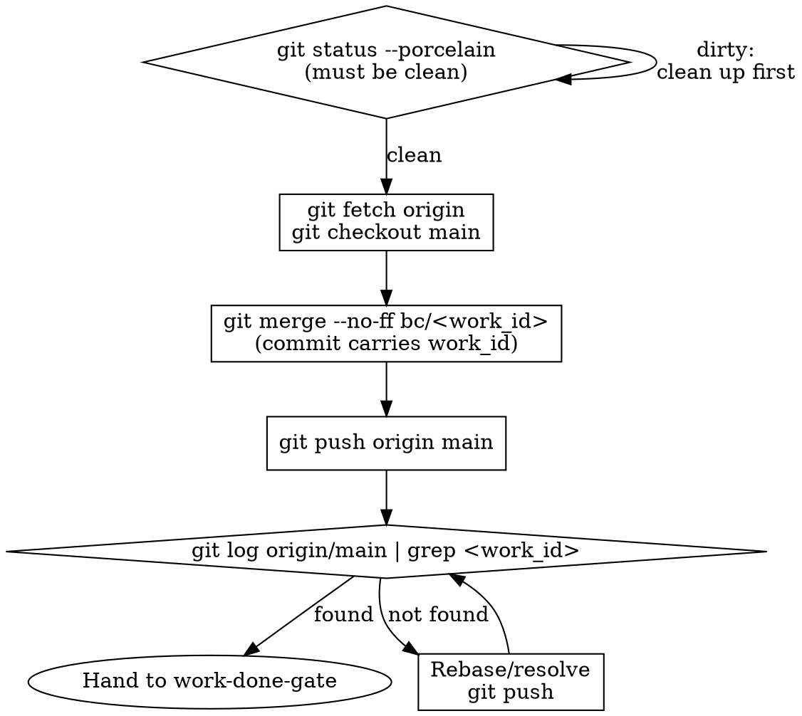

# Integrating to Main

## Overview

Before any `work_done` can be emitted, the implementation must be on `origin/main`. This skill performs that integration: merge (or squash) the work branch into the BC's `main`, commit with the work_id in the message, and push.

**Pushing is not optional.** "BC role discipline does not push" is NOT a reason to skip this step. Pushing is part of the work — the `work-done-gate` checks reachability from `origin/main` and will emit `--status blocked` if the commit is not there.

### Squash Policy and Staged-Commit Preservation

When the integration strategy is a squash merge, the squash commit **body must
enumerate the staged commits** from the work branch, so the test-first sequence
survives the squash:

```
feat: <summary> (work_id: <work_id>)

Staged commits from bc/<work_id>:
- test(red): <behavior A>
- feat(green): <behavior A>
- test(red): <behavior B>
- feat(green): <behavior B>
- refactor: <behavior B>

work_id: <work_id>
```

The reviewer reads the pre-squash **branch** history for the test-first gate
(verifying `test(red)` precedes `feat(green)` per behavior). The squash commit
body provides an audit trail in `origin/main` even after the branch is deleted.

To enumerate the staged commits for the squash body:

```bash
git log --oneline bc/<work_id> ^main   # list commits unique to the work branch
```

## Protocol

### 1. Pre-Integration Checks

In the work branch (the worktree from `using-git-worktrees`):

```bash
git status --porcelain   # must be empty — no uncommitted changes
git log --oneline -5     # confirm work commits are present
```

If the working tree is dirty, stop and clean it first.

### 2. Merge into Main

```bash
# From the BC repo root (not the worktree):
git fetch origin
git checkout main
git merge --no-ff bc/<work_id> -m "feat: <summary> (work_id: <work_id>)"
```

The `--no-ff` flag preserves the merge commit even if fast-forward is possible. This keeps the history legible per dispatch.

### 3. Work_id in the Commit

**The commit message MUST carry the work_id.** This is the attribution mechanism the `work-done-gate` checks: it searches for the work_id substring in commit messages reachable from `origin/main`.

Minimum required format:
```
feat: <brief description of what was built>

work_id: <work_id>
```

Acceptable alternatives: a tag, a `git notes` entry, or a commit subject containing the work_id substring. The gate checks via `git log --oneline origin/main | grep <work_id>` — any form that passes that check is sufficient.

### 4. Push

```bash
git push origin main
```

Verify:
```bash
git fetch origin
git log --oneline origin/main | head -5   # work_id commit must appear
```

If push fails (e.g., non-fast-forward due to concurrent work):
```bash
git pull --rebase origin main
git push origin main
```

Resolve conflicts if needed, then push. Do not stop until push succeeds.

### 5. Hand Back

Report the merge commit SHA and confirm `origin/main` is up to date. Pass this confirmation to the `work-done-gate` before any `work_done` emission.

## Flowchart



## Why This Must Not Be Skipped

The `work-done-gate` pre-emit check verifies:
```bash
git fetch origin
git log origin/main --oneline | grep <work_id>
```

If this grep fails, `work_done --status complete` is converted to `work_done --status blocked`. The only way to pass the gate is to have the commit on `origin/main`.

There is no bypass. There is no deferred push. Push is part of the work.
