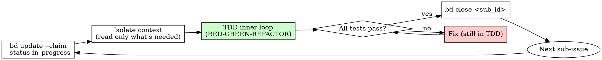

# Subagent-Driven Development

## Overview

After the router dispatches to the implementer, and after the implementer has decomposed the work into bd sub-issues (`writing-plans-bdd`), this skill governs how to execute that plan — one sub-issue at a time, with context isolation between sub-issues, and mandatory TDD for every behavior.

## The Execution Loop

For each bd sub-issue (in dependency order, leaves first):

1. **Claim the sub-issue.**
   ```bash
   bd update <sub_id> --claim
   bd update <sub_id> --status in_progress
   ```

2. **Isolate context.** Each sub-issue gets its own implementation context. Do not carry unbounded context from prior sub-issues. Read only the files you need for this behavior.

3. **Apply TDD.** Invoke the `test-driven-development` skill for this behavior. TDD is mandatory per behavior — there is no exception without the lead's decision via `clarify`.

4. **Verify green.** Run the test suite after each sub-issue. All tests must pass before claiming the sub-issue complete.

5. **Close the sub-issue.**
   ```bash
   bd close <sub_id>
   ```

6. **Move to the next sub-issue.** Repeat from step 1.



## Context Isolation

Each sub-issue has a focused scope. Before starting a sub-issue:
- Read the sub-issue description.
- Identify the minimal set of files relevant to this behavior.
- Do not load the full codebase speculatively.

This discipline keeps implementation correct sub-issue by sub-issue rather than drifting across a sprawling context.

## What the Implementer Never Does

The implementer executing this skill **never emits `work_done` for scenario-based work**. That is the reviewer's gate — and the reviewer's alone.

Specifically:
- `assign_scenarios` → implementer closes all sub-issues, runs the outer Gherkin loop, and hands off to the bc-reviewer via the router.
- `request_bugfix` with non-empty scenarios → same.
- `request_bugfix` with no scenarios, `request_maintenance` → implementer emits `work_done` directly (no reviewer dispatch).

If you are the implementer and the work carried scenarios, your job ends at: all sub-issues closed, outer Gherkin scenario(s) pass, working tree clean, hand off to reviewer.

## Outer Loop Check

After all sub-issues are closed, before handing off:

```bash
# Run the assigned Gherkin scenario(s) explicitly
pytest features/ --tags="@scenario_hash:<hash>"   # or your BC's runner
```

If any assigned scenario fails: reopen the relevant sub-issue, return to the TDD inner loop, do not hand off yet.

## bd Commands Reference

```bash
bd show <work_id>            # see all sub-issues and their status
bd update <sub_id> --claim   # claim a sub-issue
bd close <sub_id>            # close a completed sub-issue
bd create "behavior" --parent <work_id>  # add a newly discovered behavior
```

If implementation reveals a behavior not captured in the original decomposition, create a new sub-issue for it (`bd create --parent <work_id>`) rather than silently expanding the scope of an existing one.
