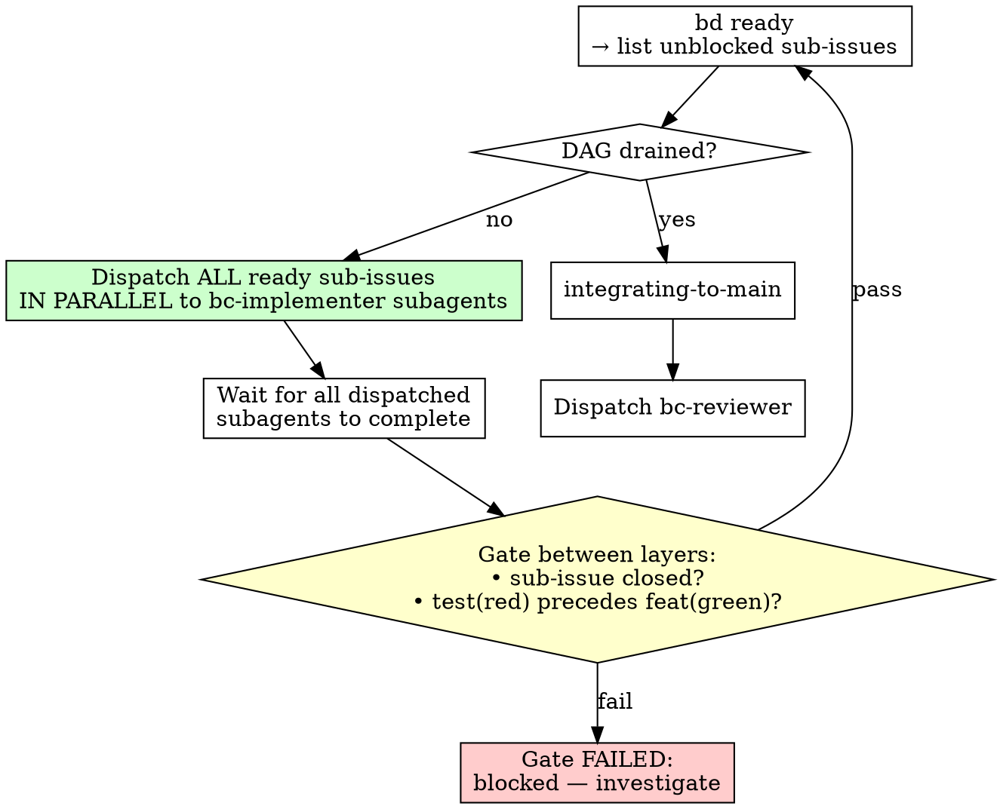

# Subagent-Driven Development

## Overview

After the router dispatches to the implementer, and after the implementer has decomposed the work into bd sub-issues (`writing-plans-bdd`), this skill governs how to execute that plan — one sub-issue at a time, with context isolation between sub-issues, and mandatory TDD for every behavior.

## The Router Dispatch Loop

The router orchestrates execution of the bd DAG (built by `writing-plans-bdd`)
using the following loop. The loop runs until the DAG is fully drained.

### Step 1: Discover Ready Sub-Issues

```bash
bd ready
```

This returns all sub-issues with no open blockers (all dependencies closed).
On the first iteration, this will be all RED ("write the failing test for
<behavior>") sub-issues that have no cross-behavior dependencies.

### Step 2: Dispatch in Parallel

Dispatch **ALL** ready sub-issues simultaneously to bc-implementer subagents
(one subagent per sub-issue). Independent sub-issues run concurrently — do
not serialize work that the DAG says can proceed in parallel.

Each bc-implementer subagent receives:
- The work_id
- The specific sub-issue ID it is responsible for
- The BC root path

### Step 3: Wait and Gate

Wait for all dispatched subagents to complete. Then, **gate between
dependency layers**:

For every sub-issue just dispatched:
1. Verify it is **closed** (`bd show <sub_id>` shows status closed).
2. For behavior sub-issues (RED or GREEN), verify the commit sequence:
   - RED sub-issue: a `test(red): <behavior>` commit exists in the
     work-branch history.
   - GREEN sub-issue: a `feat(green): <behavior>` commit follows the
     corresponding `test(red)` commit.

   ```bash
   git log --oneline bc/<work_id>   # inspect work-branch history
   ```

   If the `test(red)` commit does not precede its `feat(green)` commit,
   the gate fails — do not proceed to the next layer.

This inter-layer gate is what enforces test-first ordering across the
parallel dispatch. The gate between layers is where the router verifies the
observable artifacts of each completed layer before unblocking the next.

### Step 4: Repeat Until DAG Is Drained

Once the gate passes for the current layer, return to Step 1. The next
`bd ready` call will return sub-issues whose dependencies were just closed.

Repeat until `bd ready` returns empty (all sub-issues are closed).

### Step 5: Integrate and Dispatch Reviewer

After the DAG is fully drained:
1. Invoke `integrating-to-main` to land the work branch on `origin/main`.
2. Dispatch the bc-reviewer subagent.



## Context Isolation

Each sub-issue has a focused scope. Before starting a sub-issue:
- Read the sub-issue description.
- Identify the minimal set of files relevant to this behavior.
- Do not load the full codebase speculatively.

This discipline keeps implementation correct sub-issue by sub-issue rather than drifting across a sprawling context.

## What the Implementer Never Does

The implementer executing this skill **never emits `work_done` for scenario-based work**. That is the reviewer's gate — and the reviewer's alone.

Specifically:
- `assign_scenarios` → implementer closes all sub-issues, runs the outer Gherkin loop, and hands off to the bc-reviewer via the router.
- `request_bugfix` with non-empty scenarios → same.
- `request_bugfix` with no scenarios, `request_maintenance` → implementer emits `work_done` directly (no reviewer dispatch).

If you are the implementer and the work carried scenarios, your job ends at: all sub-issues closed, outer Gherkin scenario(s) pass, working tree clean, hand off to reviewer.

## Outer Loop Check

After all sub-issues are closed, before handing off:

```bash
# Run the assigned Gherkin scenario(s) explicitly
pytest features/ --tags="@scenario_hash:<hash>"   # or your BC's runner
```

If any assigned scenario fails: reopen the relevant sub-issue, return to the TDD inner loop, do not hand off yet.

## bd Commands Reference

```bash
bd show <work_id>            # see all sub-issues and their status
bd update <sub_id> --claim   # claim a sub-issue
bd close <sub_id>            # close a completed sub-issue
bd create "behavior" --parent <work_id>  # add a newly discovered behavior
```

If implementation reveals a behavior not captured in the original decomposition, create a new sub-issue for it (`bd create --parent <work_id>`) rather than silently expanding the scope of an existing one.
