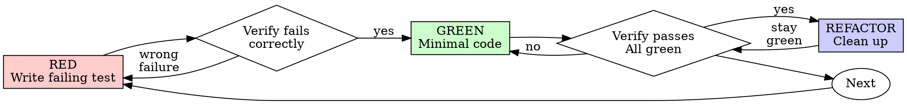

# Test-Driven Development (TDD)

## Overview

Write the test first. Watch it fail. Write minimal code to pass.

**Core principle:** If you didn't watch the test fail, you don't know if it tests the right thing.

**Violating the letter of the rules is violating the spirit of the rules.**

> **shopsystem note (experimental).** This is an adapted variant of the
> external test-driven-development skill, tuned for a BC Implementer running
> autonomously inside a container. There is no human in the BC's loop; where
> the original skill defers to a "human partner," the BC instead emits a
> `clarify` message to the lead and awaits the lead's decision. This draft is
> meant to be learned from, not treated as canon.

## TDD Is Mandatory in This BC

**TDD is MANDATORY in this BC — not optional.** There is no self-granted exception. If you believe an exception applies (throwaway prototype, generated code, configuration file), you do NOT decide unilaterally: emit a `clarify` message to the lead naming the work and the exception you think applies, and await the lead's decision before proceeding without TDD.

The only exception path is: emit `clarify` → await the lead's decision. No other path exists.

## Staged-Commit Convention

For each behavior, commit the cycle phases separately and with the prescribed
prefixes. Frequent, staged commits are required — at minimum one RED commit
and one GREEN commit per behavior:

| Phase | Commit message | When to commit |
|---|---|---|
| RED | `test(red): <behavior>` | After writing the failing test, before any implementation |
| GREEN | `feat(green): <behavior>` | After the test passes with minimal implementation |
| REFACTOR | `refactor: <behavior>` | After each clean-up pass (optional but encouraged) |

**Never combine RED and GREEN into one commit.** The commit history is an
observable artifact — the router's inter-layer gate and the work-done-gate
both verify that `test(red): <behavior>` precedes `feat(green): <behavior>`
in the work-branch history.

Example (for behavior "empty email rejection"):

```bash
# After writing the failing test:
git add tests/test_email.py
git commit -m "test(red): empty email rejection"

# After implementing the fix:
git add src/email.py
git commit -m "feat(green): empty email rejection"

# Optional refactor:
git add src/email.py
git commit -m "refactor: empty email rejection"
```

## The Two Loops

A BC Implementer works against **two nested loops**, and TDD lives in the inner one.

- **Outer loop — the assigned Gherkin scenario(s).** The scenario(s) the lead
  dispatched are the acceptance specification: they pin *what behavior is
  required* and they are *what `work_done` proves*. The scenario is silent on
  internal decomposition — it says nothing about which functions, classes, or
  modules you write. The outer loop is satisfied when the assigned scenario(s)
  pass against your implementation.

- **Inner loop — RED-GREEN-REFACTOR.** For each behavior you must build to make
  the assigned scenario(s) pass, you run the TDD cycle below. This is where the
  BC does its own internal design: the scenario tells you the destination, and
  the inner loop is how you get there, one failing test at a time. This skill
  fills the gap the scenario deliberately leaves open.

When a piece of assigned work decomposes into multiple behaviors, track those
behaviors as **bd sub-issues** of the work's lead bead — never as TodoWrite
entries or markdown checklists. The bd registry is the single source of truth
for decomposition.

## When to Use

**Always:**
- New features
- Bug fixes
- Refactoring
- Behavior changes

**Exceptions (emit a `clarify` to the lead and await the decision):**
- Throwaway prototypes
- Generated code
- Configuration files

When you believe an exception applies, do not decide unilaterally: emit a
`clarify` message to the lead naming the work and the exception you think
applies, and await the lead's answer before proceeding.

Thinking "skip TDD just this once"? Stop. That's rationalization.

## The Iron Law

```
NO PRODUCTION CODE WITHOUT A FAILING TEST FIRST
```

Write code before the test? Delete it. Start over.

**No exceptions:**
- Don't keep it as "reference"
- Don't "adapt" it while writing tests
- Don't look at it
- Delete means delete

Implement fresh from tests. Period.

## Red-Green-Refactor



> **Test runner.** The commands below are illustrative. Use whatever test
> runner the BC's own harness uses. For a Python BC this is typically
> `pytest <path>`; a TypeScript BC would use `npm test <path>`. Substitute your
> BC's runner throughout — the discipline is the same regardless of runner.

### RED - Write Failing Test

Write one minimal test showing what should happen.

<Good>
```python
def test_retries_failed_operations_3_times():
    attempts = {"count": 0}

    def operation():
        attempts["count"] += 1
        if attempts["count"] < 3:
            raise RuntimeError("fail")
        return "success"

    result = retry_operation(operation)

    assert result == "success"
    assert attempts["count"] == 3
```
Clear name, tests real behavior, one thing
</Good>

<Bad>
```python
def test_retry_works(mocker):
    mock = mocker.Mock(side_effect=[RuntimeError(), RuntimeError(), "success"])
    retry_operation(mock)
    assert mock.call_count == 3
```
Vague name, tests mock not code
</Bad>

**Requirements:**
- One behavior
- Clear name
- Real code (no mocks unless unavoidable)

### Verify RED - Watch It Fail

**MANDATORY. Never skip.**

```bash
pytest path/to/test_retry.py   # or your BC's runner
```

Confirm:
- Test fails (not errors)
- Failure message is expected
- Fails because feature missing (not typos)

**Test passes?** You're testing existing behavior. Fix test.

**Test errors?** Fix error, re-run until it fails correctly.

### GREEN - Minimal Code

Write simplest code to pass the test.

<Good>
```python
def retry_operation(fn):
    for i in range(3):
        try:
            return fn()
        except Exception:
            if i == 2:
                raise
    raise RuntimeError("unreachable")
```
Just enough to pass
</Good>

<Bad>
```python
def retry_operation(fn, max_retries=None, backoff=None, on_retry=None):
    # YAGNI
    ...
```
Over-engineered
</Bad>

Don't add features, refactor other code, or "improve" beyond the test.

### Verify GREEN - Watch It Pass

**MANDATORY.**

```bash
pytest path/to/test_retry.py   # or your BC's runner
```

Confirm:
- Test passes
- Other tests still pass
- Output pristine (no errors, warnings)

**Test fails?** Fix code, not test.

**Other tests fail?** Fix now.

### REFACTOR - Clean Up

After green only:
- Remove duplication
- Improve names
- Extract helpers

Keep tests green. Don't add behavior.

### Repeat

Next failing test for next behavior. (Each behavior is a bd sub-issue when the
work decomposes — see The Two Loops.)

## Good Tests

| Quality | Good | Bad |
|---------|------|-----|
| **Minimal** | One thing. "and" in name? Split it. | `test_validates_email_and_domain_and_whitespace` |
| **Clear** | Name describes behavior | `test_test1` |
| **Shows intent** | Demonstrates desired API | Obscures what code should do |

## Why Order Matters

**"I'll write tests after to verify it works"**

Tests written after code pass immediately. Passing immediately proves nothing:
- Might test wrong thing
- Might test implementation, not behavior
- Might miss edge cases you forgot
- You never saw it catch the bug

Test-first forces you to see the test fail, proving it actually tests something.

**"I already manually tested all the edge cases"**

Manual testing is ad-hoc. You think you tested everything but:
- No record of what you tested
- Can't re-run when code changes
- Easy to forget cases under pressure
- "It worked when I tried it" ≠ comprehensive

Automated tests are systematic. They run the same way every time.

**"Deleting X hours of work is wasteful"**

Sunk cost fallacy. The time is already gone. Your choice now:
- Delete and rewrite with TDD (X more hours, high confidence)
- Keep it and add tests after (30 min, low confidence, likely bugs)

The "waste" is keeping code you can't trust. Working code without real tests is technical debt.

**"TDD is dogmatic, being pragmatic means adapting"**

TDD IS pragmatic:
- Finds bugs before commit (faster than debugging after)
- Prevents regressions (tests catch breaks immediately)
- Documents behavior (tests show how to use code)
- Enables refactoring (change freely, tests catch breaks)

"Pragmatic" shortcuts = debugging in production = slower.

**"Tests after achieve the same goals - it's spirit not ritual"**

No. Tests-after answer "What does this do?" Tests-first answer "What should this do?"

Tests-after are biased by your implementation. You test what you built, not what's required. You verify remembered edge cases, not discovered ones.

Tests-first force edge case discovery before implementing. Tests-after verify you remembered everything (you didn't).

30 minutes of tests after ≠ TDD. You get coverage, lose proof tests work.

## Common Rationalizations

| Excuse | Reality |
|--------|---------|
| "Too simple to test" | Simple code breaks. Test takes 30 seconds. |
| "I'll test after" | Tests passing immediately prove nothing. |
| "Tests after achieve same goals" | Tests-after = "what does this do?" Tests-first = "what should this do?" |
| "Already manually tested" | Ad-hoc ≠ systematic. No record, can't re-run. |
| "Deleting X hours is wasteful" | Sunk cost fallacy. Keeping unverified code is technical debt. |
| "Keep as reference, write tests first" | You'll adapt it. That's testing after. Delete means delete. |
| "Need to explore first" | Fine. Throw away exploration, start with TDD. |
| "Test hard = design unclear" | Listen to test. Hard to test = hard to use. |
| "TDD will slow me down" | TDD faster than debugging. Pragmatic = test-first. |
| "Manual test faster" | Manual doesn't prove edge cases. You'll re-test every change. |
| "Existing code has no tests" | You're improving it. Add tests for existing code. |

## Red Flags - STOP and Start Over

- Code before test
- Test after implementation
- Test passes immediately
- Can't explain why test failed
- Tests added "later"
- Rationalizing "just this once"
- "I already manually tested it"
- "Tests after achieve the same purpose"
- "It's about spirit not ritual"
- "Keep as reference" or "adapt existing code"
- "Already spent X hours, deleting is wasteful"
- "TDD is dogmatic, I'm being pragmatic"
- "This is different because..."

**All of these mean: Delete code. Start over with TDD.**

## Example: Bug Fix

**Bug:** Empty email accepted

**RED**
```python
def test_rejects_empty_email():
    result = submit_form({"email": ""})
    assert result["error"] == "Email required"
```

**Verify RED**
```bash
$ pytest   # or your BC's runner
FAILED: KeyError: 'error'  (expected 'Email required', got nothing)
```

**GREEN**
```python
def submit_form(data):
    if not (data.get("email") or "").strip():
        return {"error": "Email required"}
    # ...
```

**Verify GREEN**
```bash
$ pytest   # or your BC's runner
PASSED
```

**REFACTOR**
Extract validation for multiple fields if needed.

## Verification Checklist

Before marking work complete (emitting `work_done`):

- [ ] **The assigned Gherkin scenario(s) pass** (the outer loop — this is what
      `work_done` proves)
- [ ] **The working tree is clean** (no uncommitted changes, no stray files)
- [ ] Every new function/method has a test
- [ ] Watched each test fail before implementing
- [ ] Each test failed for expected reason (feature missing, not typo)
- [ ] Wrote minimal code to pass each test
- [ ] All tests pass
- [ ] Output pristine (no errors, warnings)
- [ ] Tests use real code (mocks only if unavoidable)
- [ ] Edge cases and errors covered

Can't check all boxes? You skipped TDD. Start over.

> **What `work_done` surfaces.** `work_done` evidence is, and remains, *the
> assigned scenario(s) pass* against a clean working tree. The TDD discipline
> in this skill is the engineering process you follow to get there — at this
> time it is **not** evidence the BC surfaces in `work_done`. Run the inner
> loop because it produces correct, trustworthy code; do not attempt to report
> RED-GREEN-REFACTOR transcripts, per-test fail-watch logs, or TDD adherence as
> part of the `work_done` payload.

## When Stuck

| Problem | Solution |
|---------|----------|
| Don't know how to test | Write wished-for API. Write assertion first. Still stuck? Emit a `clarify` to the lead. |
| Test too complicated | Design too complicated. Simplify interface. |
| Must mock everything | Code too coupled. Use dependency injection. |
| Test setup huge | Extract helpers. Still complex? Simplify design. |

## Debugging Integration

Bug found? Write failing test reproducing it. Follow TDD cycle. Test proves fix and prevents regression.

Never fix bugs without a test.

## Testing Anti-Patterns

When adding mocks or test utilities, read @testing-anti-patterns.md to avoid common pitfalls:
- Testing mock behavior instead of real behavior
- Adding test-only methods to production classes
- Mocking without understanding dependencies

## Final Rule

```
Production code → test exists and failed first
Otherwise → not TDD
```

No exceptions without the lead's decision. If you believe an exception applies,
emit a `clarify` to the lead and await the answer — never grant yourself the
exception.
