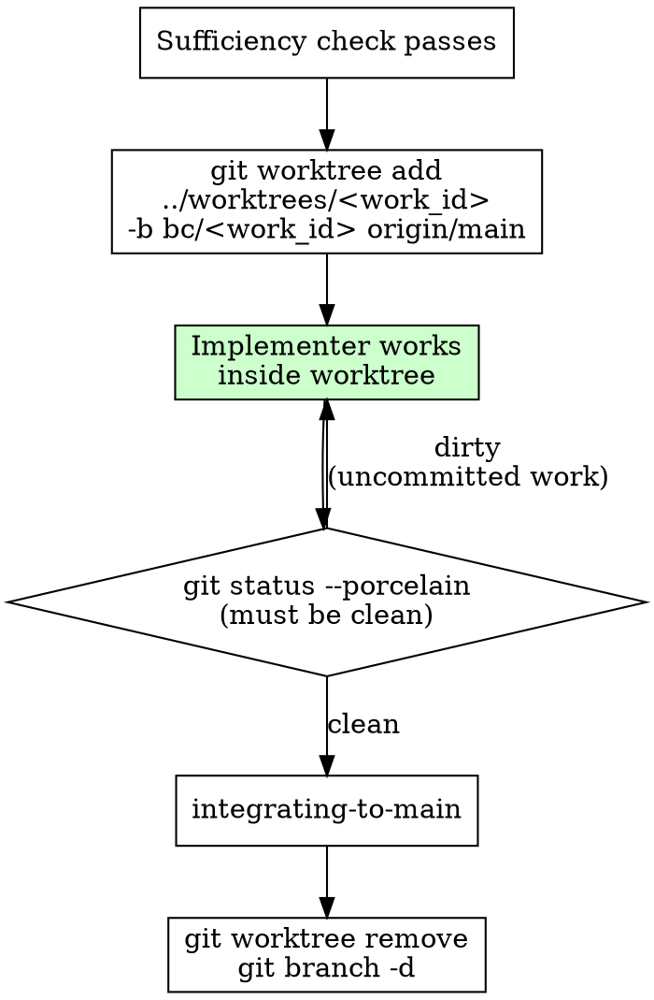

# Using Git Worktrees

## Overview

Every dispatch gets its own worktree and branch. This prevents implementation work for one `work_id` from bleeding into another and keeps the BC's `main` clean until the `integrating-to-main` gate.

The router invokes this skill after the sufficiency check passes and before dispatching to the implementer.

## Protocol

### 1. Name the Branch

The branch name is derived from the `work_id`:

```
bc/<work_id>
```

Example: work_id `shopsystem-auth-abc123` → branch `bc/shopsystem-auth-abc123`.

### 2. Create the Worktree

From the BC repository root:

```bash
git fetch origin
git worktree add ../worktrees/<work_id> -b bc/<work_id> origin/main
```

This creates a worktree at `../worktrees/<work_id>` checked out to a new branch `bc/<work_id>` based on `origin/main`.

**Operate only inside the BC root.** The worktree path is `../worktrees/<work_id>` relative to the BC repo root — it stays within the BC's domain. Do not create worktrees outside the BC's root or in shared directories.

### 3. Hand the Worktree to the Implementer

Pass the worktree path to the implementer subagent. All implementation work (`src/`, `tests/`, `features/`) happens inside this worktree, never on `main` directly.

### 4. Hand Back Before the Gate

When the implementer's work is complete, before invoking the reviewer gate or `integrating-to-main`:

```bash
# In the worktree:
git status --porcelain   # must be clean
git log --oneline -5     # confirm commits carry the work_id
```

Pass the branch name `bc/<work_id>` to `integrating-to-main`.

### 5. Clean Up After Integration

After `integrating-to-main` completes and `work_done` is emitted:

```bash
git worktree remove ../worktrees/<work_id>
git branch -d bc/<work_id>
```

Remove the worktree and the local branch. The work is now on `origin/main`; the branch is no longer needed.

## Flowchart



## Edge Cases

**Existing branch.** If `bc/<work_id>` already exists (e.g., a prior interrupted session), do not create a new one. Resume from the existing branch:
```bash
git worktree add ../worktrees/<work_id> bc/<work_id>
```

**Worktree already registered.** If git reports the worktree already exists, check whether the work was already completed and the worktree was not cleaned up. Remove the stale worktree with `git worktree prune` before proceeding.

**BC root boundary.** All worktree paths must be within or adjacent to the BC repository root. Never place worktrees in lead-shop directories, shared volumes, or paths the BC does not own.
