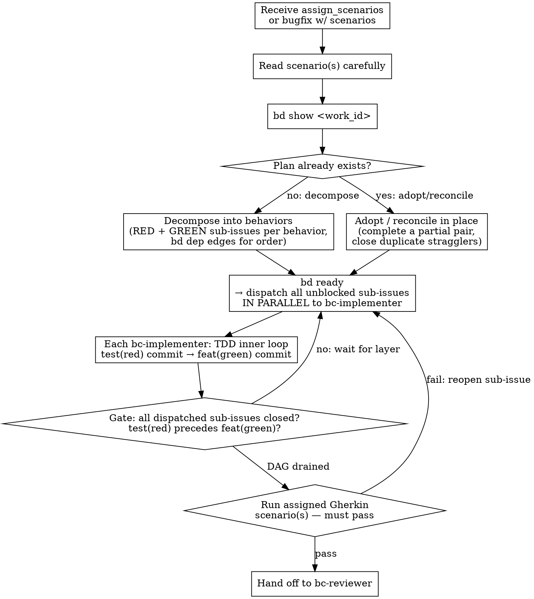

# Writing Plans (BDD)

## Overview

When the router dispatches `assign_scenarios` or `request_bugfix` (with scenarios) work to the implementer, the implementer must plan before coding. The plan is not a document — **no plan document**, no markdown file, no checklist. The plan lives in **beads as sub-issues** of the work's lead bead.

This ensures:
- The decomposition is visible in the registry (not buried in a conversation turn).
- Each sub-issue has a lifecycle: claimed, in-progress, closed.
- The plan survives context resets.

## Check for an Existing Plan First (idempotency)

**Before creating any sub-issue, run `bd show <work_id>` and read the
existing decomposition.** The plan step is **idempotent**: re-entering it
(after a context reset, a reopened sub-issue, a clarify round-trip, or a
re-dispatch) must RECONCILE the existing plan, never blindly re-decompose.

Decide per behavior the assigned scenario(s) require:

- **No sub-issues exist** → decompose (create the RED/GREEN pair as today).
- **A complete RED/GREEN pair already exists for the behavior** → ADOPT it.
  Create nothing. Claim and execute the existing pair.
- **Partial or inconsistent** (e.g. a RED without its GREEN, or duplicate
  legs) → RECONCILE IN PLACE: add only the missing leg(s), or close the
  stragglers with `bd close --reason "<reason>"` naming the surviving plan.
  **Never leave two sub-issues decomposing one behavior.**

**Definition — "already planned":** a RED ("write the failing test for
`<behavior>`") AND its GREEN ("implement `<behavior>`") already exist under
this `work_id`, matched on the behavior the title names. If both legs are
present and consistent, the behavior is planned; do not create a second pair.

## Plan Structure

### Two Sub-Issues Per Behavior: RED and GREEN

For each discrete behavior that must be built to make the assigned scenario(s)
pass, create **two** bd sub-issues of the lead bead:

1. **RED sub-issue** — "write the failing test for `<behavior>`"
   - This sub-issue is complete when the failing test is committed as
     `test(red): <behavior>` and the test suite confirms the test fails for
     the right reason.

2. **GREEN sub-issue** — "implement `<behavior>`"
   - This sub-issue is complete when the implementation is committed as
     `feat(green): <behavior>` and the test is passing.

Then add a dependency so the GREEN sub-issue cannot start until the RED
sub-issue is closed:

```bash
bd dep add <green_id> <red_id>
```

This dependency DAG is the enforcement point for test-first order. The router
reads it via `bd ready` to know which sub-issues are unblocked and can be
dispatched.

**Naming convention:**
- RED: "write the failing test for <behavior>" — e.g. "write the failing test for empty email rejection"
- GREEN: "implement <behavior>" — e.g. "implement empty email rejection"
- GREEN's description: note which RED sub-issue it unblocks from, and which assigned scenario(s) it serves.

### BDD Outer Loop Preservation

The assigned Gherkin scenario(s) are the **BDD outer loop** — they pin what
`work_done` proves. Decomposition must not change what that proof is.

Concretely: you may decompose into as many RED/GREEN sub-issue pairs as
needed, but every sub-issue must exist in service of making the assigned
scenario(s) pass. You may NOT:
- Rewrite or reinterpret a scenario's Given/When/Then to fit your decomposition.
- Declare the outer loop satisfied by a subset of the assigned scenarios.
- Add net-new scenarios to `features/` that were not assigned.

### Cross-Behavior Dependencies

When behavior B depends on behavior A (e.g. B builds on an abstraction A
introduces), encode that as `bd dep` edges in addition to the RED/GREEN edges:

```bash
# A's GREEN must be closed before B's RED can start
bd dep add <B_red_id> <A_green_id>
```

This forms an explicit DAG. The router dispatches any sub-issue with no open
blockers (`bd ready`) — independent RED sub-issues at the same layer are
dispatched **in parallel** to bc-implementer subagents. Dependent sub-issues
wait until all their blockers are closed.

## `bd` Commands

```bash
# ADOPT EXISTING — never create blind. Read the current plan first.
bd show <work_id>
# No sub-issues → decompose below.
# Complete RED/GREEN pair for the behavior already present → adopt it, create nothing.
# Partial/duplicate → reconcile in place (add the missing leg, or
#   `bd close <straggler> --reason "duplicate of <surviving_id>"`).

# Create the RED sub-issue
bd create "write the failing test for <behavior>" --parent <work_id>
# → prints <red_id>

# Create the GREEN sub-issue
bd create "implement <behavior>" --parent <work_id>
# → prints <green_id>

# Add RED→GREEN dependency: GREEN waits for RED
bd dep add <green_id> <red_id>

# For cross-behavior deps: B's RED waits for A's GREEN
bd dep add <B_red_id> <A_green_id>

# Mark claimed and in-progress as you work each behavior
bd update <sub_id> --claim
bd update <sub_id> --status in_progress

# Close when complete (RED: failing test committed; GREEN: impl + passing)
bd close <sub_id>

# Check what's ready (no open blockers) — used by the router dispatch loop
bd ready
```

`bd dep add` establishes the parent-child relationship so `bd show <work_id>`
surfaces the full decomposition tree with dependency edges.

## Workflow



## Rules

1. **No plan document.** Do not create a PLAN.md, TODO.md, or any markdown planning artifact. The bd registry is the single source of truth for decomposition.
2. **Two sub-issues per behavior.** Every behavior gets one RED ("write the failing test for <behavior>") and one GREEN ("implement <behavior>") sub-issue, with `bd dep add <green> <red>`.
3. **Sub-issues only.** Do not use `TodoWrite`, inline checklists, or scratch notes for tracking. If it's work, it's a bead.
4. **Close sub-issues promptly.** Close each sub-issue when its TDD phase is complete. Do not batch-close at the end.
5. **The outer loop is immutable.** The assigned scenario(s) are fixed. You build to them; you do not negotiate them during implementation.
6. **Parallel dispatch.** Sub-issues with no open blockers (`bd ready`) are dispatched together, in parallel, by the router. Dependent sub-issues wait for all their blockers to close before being dispatched.
7. **Plan once — idempotent decomposition.** Run `bd show <work_id>` before creating any sub-issue. A re-entered plan step RECONCILES the existing plan (adopt a complete pair, complete a partial one, close duplicate stragglers); it does NOT duplicate. Two sub-issues decomposing one behavior is a defect the work-done-gate blocks on.

## Sizing Sub-Issues

A well-sized sub-issue takes one TDD inner loop (one RED-GREEN-REFACTOR cycle, possibly a few tests). If a sub-issue's description contains "and" or spans multiple components, split it.

If you cannot decompose the work without reinterpreting an assigned scenario, that is a signal the scenario may be ambiguous. File a `clarify` to the lead before proceeding.
