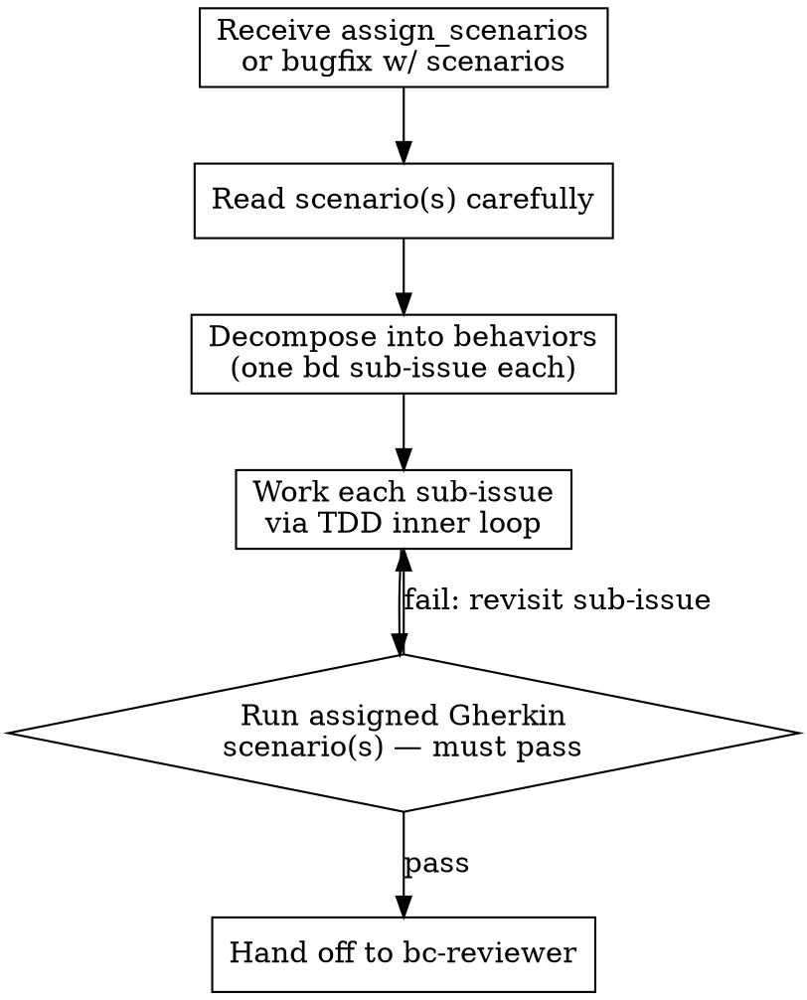

# Writing Plans (BDD)

## Overview

When the router dispatches `assign_scenarios` or `request_bugfix` (with scenarios) work to the implementer, the implementer must plan before coding. The plan is not a document — **no plan document**, no markdown file, no checklist. The plan lives in **beads as sub-issues** of the work's lead bead.

This ensures:
- The decomposition is visible in the registry (not buried in a conversation turn).
- Each sub-issue has a lifecycle: claimed, in-progress, closed.
- The plan survives context resets.

## Plan Structure

### One Sub-Issue Per Behavior

Decompose the assigned scenario(s) into the behaviors that must be built or changed to make them pass. Each discrete behavior becomes **one `bd` sub-issue** of the lead bead.

- Sub-issue title: name the behavior, not the implementation ("validate empty email input" not "add if-statement to submit_form").
- Sub-issue description: note which assigned scenario(s) this behavior serves.
- Sub-issue scope: one TDD inner loop per sub-issue.

### BDD Outer Loop Preservation

The assigned Gherkin scenario(s) are the **BDD outer loop** — they pin what `work_done` proves. Decomposition must not change what that proof is.

Concretely: you may decompose into as many sub-issues as needed, but every sub-issue must exist in service of making the assigned scenario(s) pass. You may NOT:
- Rewrite or reinterpret a scenario's Given/When/Then to fit your decomposition.
- Declare the outer loop satisfied by a subset of the assigned scenarios.
- Add net-new scenarios to `features/` that were not assigned.

## `bd` Commands

```bash
# Create a sub-issue and link it as a child of the lead bead
bd create "validate empty email input" --parent <work_id>
bd dep add <sub_id> --parent <work_id>     # if created separately

# Mark claimed and in-progress as you work each behavior
bd update <sub_id> --claim
bd update <sub_id> --status in_progress

# Close when the behavior is TDD-complete and the inner loop is green
bd close <sub_id>
```

`bd dep add` establishes the parent-child relationship so `bd show <work_id>` surfaces the full decomposition tree.

## Workflow



## Rules

1. **No plan document.** Do not create a PLAN.md, TODO.md, or any markdown planning artifact. The bd registry is the single source of truth for decomposition.
2. **Sub-issues only.** Do not use `TodoWrite`, inline checklists, or scratch notes for tracking. If it's work, it's a bead.
3. **Close sub-issues promptly.** Close each sub-issue when its TDD inner loop is complete and its tests pass. Do not batch-close at the end.
4. **The outer loop is immutable.** The assigned scenario(s) are fixed. You build to them; you do not negotiate them during implementation.

## Sizing Sub-Issues

A well-sized sub-issue takes one TDD inner loop (one RED-GREEN-REFACTOR cycle, possibly a few tests). If a sub-issue's description contains "and" or spans multiple components, split it.

If you cannot decompose the work without reinterpreting an assigned scenario, that is a signal the scenario may be ambiguous. File a `clarify` to the lead before proceeding.
